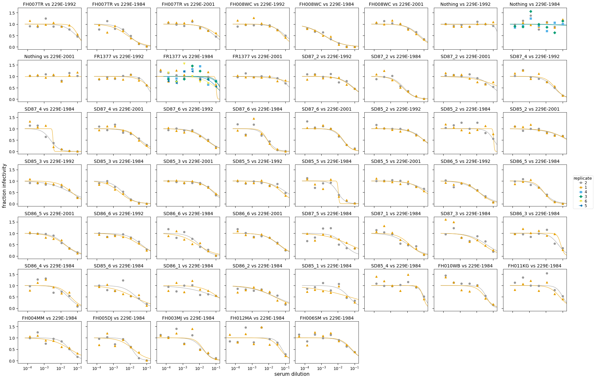
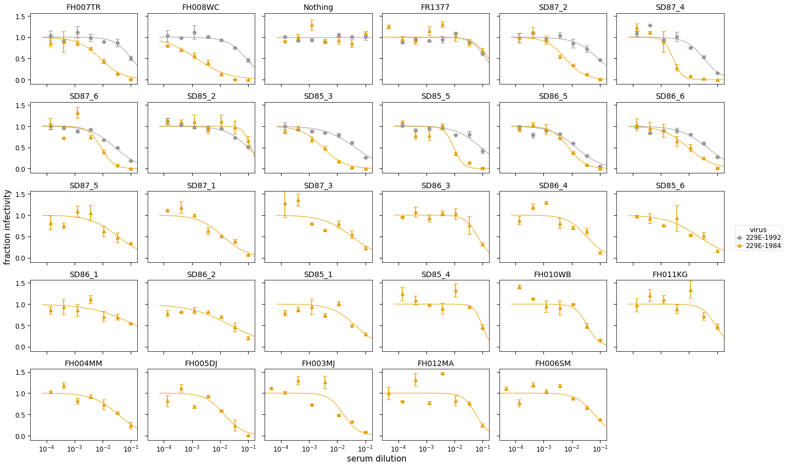

# Analyze neutralization data
This Python Jupyter notebook analyzes the neutralization data.

Import Python modules.
We use [neutcurve](https://jbloomlab.github.io/neutcurve/) to plot the neutralization curves:


```python
import warnings

from IPython.display import display, HTML

import matplotlib.pyplot as plt

import neutcurve
from neutcurve.colorschemes import CBPALETTE
from neutcurve.colorschemes import CBMARKERS

import pandas as pd

print(f"Using `neutcurve` version {neutcurve.__version__}")
```

    Using `neutcurve` version 0.5.0


Specify input / output files:


```python
# input files
fracinfect_file = 'results/fracinfect.csv'

# output files
all_replicate_curves = 'results/all_neut_replicates.pdf'
all_neut_by_sera_curves = 'results/all_neut_by_sera.pdf'
all_fit_params = 'results/all_fit_params.csv'
all_neut_titers = 'results/all_neut_titers.csv'
```

Read in the neutralization data:


```python
print(f"Reading neutralization data from {fracinfect_file}")
fracinfect = pd.read_csv(fracinfect_file)

# Input data restarts replicate numbers for each new date. Instead label replicates as:
#  - replicate_on_date: number of the replicate on that specific date
#  - replicate_with_date: number of replicate on that date suffixed by date
#  - replicate_all_dates: number replicates sequentially across all dates
fracinfect = (
    fracinfect
    .assign(replicate_with_date=lambda x: x['replicate'].astype(str) +
                                          ' (' + x['date'] + ')')
    .rename(columns={'replicate': 'replicate_on_date'})
    )
fracinfect = (
    fracinfect
    .merge(fracinfect
           .sort_values('date')
           [['serum', 'virus', 'replicate_with_date']]
           .drop_duplicates()
           .assign(replicate_all_dates=lambda x: x.groupby(['serum', 'virus'])
                                                  ['replicate_with_date']
                                                  .transform('cumcount') + 1
                   ),
            how='left', on=['serum', 'virus', 'replicate_with_date'], validate='many_to_one',
            )
    )

# make sure unique reading for each virus / serum / replicate / date
assert len(fracinfect) == len(fracinfect.groupby(['serum',
                                                  'virus',
                                                  'replicate_all_dates',
                                                  'concentration',
                                                  ]))

# show first few lines of data frame
display(HTML(fracinfect.head().to_html()))
```

    Reading neutralization data from results/fracinfect.csv


<table border="1" class="dataframe">
  <thead>
    <tr style="text-align: right;">
      <th></th>
      <th>serum</th>
      <th>virus</th>
      <th>replicate_on_date</th>
      <th>concentration</th>
      <th>fraction infectivity</th>
      <th>date</th>
      <th>replicate_with_date</th>
      <th>replicate_all_dates</th>
    </tr>
  </thead>
  <tbody>
    <tr>
      <th>0</th>
      <td>FH007TR</td>
      <td>229E-1992</td>
      <td>1</td>
      <td>0.100000</td>
      <td>0.4530</td>
      <td>2020-10-22</td>
      <td>1 (2020-10-22)</td>
      <td>2</td>
    </tr>
    <tr>
      <th>1</th>
      <td>FH007TR</td>
      <td>229E-1992</td>
      <td>1</td>
      <td>0.033330</td>
      <td>0.7756</td>
      <td>2020-10-22</td>
      <td>1 (2020-10-22)</td>
      <td>2</td>
    </tr>
    <tr>
      <th>2</th>
      <td>FH007TR</td>
      <td>229E-1992</td>
      <td>1</td>
      <td>0.011110</td>
      <td>0.8930</td>
      <td>2020-10-22</td>
      <td>1 (2020-10-22)</td>
      <td>2</td>
    </tr>
    <tr>
      <th>3</th>
      <td>FH007TR</td>
      <td>229E-1992</td>
      <td>1</td>
      <td>0.003704</td>
      <td>0.9029</td>
      <td>2020-10-22</td>
      <td>1 (2020-10-22)</td>
      <td>2</td>
    </tr>
    <tr>
      <th>4</th>
      <td>FH007TR</td>
      <td>229E-1992</td>
      <td>1</td>
      <td>0.001235</td>
      <td>1.2490</td>
      <td>2020-10-22</td>
      <td>1 (2020-10-22)</td>
      <td>2</td>
    </tr>
  </tbody>
</table>


Use [neutcurve](https://jbloomlab.github.io/neutcurve/) to fit neutralization curves to all of the data:


```python
fits = neutcurve.curvefits.CurveFits(
            data=fracinfect,
            replicate_col='replicate_all_dates',
            fixbottom=0,
            fixtop=1,
            )
```

Plot all curves for all replicates of all virus / serum combinations:


```python
with warnings.catch_warnings():
    warnings.simplefilter('ignore')  # ignore fitting warnings
    fig, _ = fits.plotReplicates(ncol=8,
                                 legendtitle='replicate',
                                 xlabel='serum dilution',
                                 )
    
print(f"Saving plot to {all_replicate_curves}\n")
fig.savefig(all_replicate_curves)
fig.tight_layout()
display(fig)
plt.close(fig)
```

    Saving plot to results/all_neut_replicates.pdf
    


    

    


Make a plot showing:


```python
fig, _ = fits.plotSera(xlabel='serum dilution',
                       ncol=6,
                       legendtitle='virus')

print(f"Saving plot to {all_neut_by_sera_curves}\n")
fig.savefig(all_neut_by_sera_curves)
fig.tight_layout()
display(fig)
plt.close(fig)
```

    /fh/fast/bloom_j/software/miniconda3/envs/CoV_229E_antigenic_drift/lib/python3.8/site-packages/scipy/optimize/minpack.py:828: OptimizeWarning: Covariance of the parameters could not be estimated
      warnings.warn('Covariance of the parameters could not be estimated',
    /fh/fast/bloom_j/software/miniconda3/envs/CoV_229E_antigenic_drift/lib/python3.8/site-packages/neutcurve/hillcurve.py:689: RuntimeWarning: invalid value encountered in power
      return b + (t - b) / (1 + (c / m)**s)


    Saving plot to results/all_neut_by_sera.pdf
    


    

    


Write all of the fit parameters to a file:


```python
print(f"Writing all fit parameters to {all_fit_params}; first few lines also printed below:")

display(HTML(fits.fitParams().head().to_html()))

fits.fitParams().to_csv(all_fit_params, index=False)
```

    Writing all fit parameters to results/all_fit_params.csv; first few lines also printed below:


<table border="1" class="dataframe">
  <thead>
    <tr style="text-align: right;">
      <th></th>
      <th>serum</th>
      <th>virus</th>
      <th>replicate</th>
      <th>nreplicates</th>
      <th>ic50</th>
      <th>ic50_bound</th>
      <th>ic50_str</th>
      <th>midpoint</th>
      <th>slope</th>
      <th>top</th>
      <th>bottom</th>
    </tr>
  </thead>
  <tbody>
    <tr>
      <th>0</th>
      <td>FH007TR</td>
      <td>229E-1992</td>
      <td>average</td>
      <td>2</td>
      <td>0.100000</td>
      <td>lower</td>
      <td>&gt;0.1</td>
      <td>0.103966</td>
      <td>1.414215</td>
      <td>1</td>
      <td>0</td>
    </tr>
    <tr>
      <th>1</th>
      <td>FH007TR</td>
      <td>229E-1984</td>
      <td>average</td>
      <td>2</td>
      <td>0.008009</td>
      <td>interpolated</td>
      <td>0.00801</td>
      <td>0.008009</td>
      <td>1.074526</td>
      <td>1</td>
      <td>0</td>
    </tr>
    <tr>
      <th>2</th>
      <td>FH008WC</td>
      <td>229E-1992</td>
      <td>average</td>
      <td>2</td>
      <td>0.084957</td>
      <td>interpolated</td>
      <td>0.085</td>
      <td>0.084957</td>
      <td>1.268635</td>
      <td>1</td>
      <td>0</td>
    </tr>
    <tr>
      <th>3</th>
      <td>FH008WC</td>
      <td>229E-1984</td>
      <td>average</td>
      <td>2</td>
      <td>0.001461</td>
      <td>interpolated</td>
      <td>0.00146</td>
      <td>0.001461</td>
      <td>0.765615</td>
      <td>1</td>
      <td>0</td>
    </tr>
    <tr>
      <th>4</th>
      <td>Nothing</td>
      <td>229E-1992</td>
      <td>average</td>
      <td>2</td>
      <td>0.100000</td>
      <td>lower</td>
      <td>&gt;0.1</td>
      <td>1.376719</td>
      <td>8.518559</td>
      <td>1</td>
      <td>0</td>
    </tr>
  </tbody>
</table>


Get neutralization titers:


```python
neut_titers = (
    fits.fitParams()
    .assign(neut_titer=lambda x: 1 / x['ic50'])
    .assign(is_upper_bound=lambda x: x['ic50_bound'].map({'lower': True,
                                                          'interpolated': False}))
    [['serum', 'virus', 'neut_titer', 'is_upper_bound']]
    )
display(HTML(neut_titers.to_html(float_format='%.1f')))

print(f"Writing to {all_neut_titers}")
neut_titers.to_csv(all_neut_titers, index=False, float_format='%.1f')
```


<table border="1" class="dataframe">
  <thead>
    <tr style="text-align: right;">
      <th></th>
      <th>serum</th>
      <th>virus</th>
      <th>neut_titer</th>
      <th>is_upper_bound</th>
    </tr>
  </thead>
  <tbody>
    <tr>
      <th>0</th>
      <td>FH007TR</td>
      <td>229E-1992</td>
      <td>10.0</td>
      <td>True</td>
    </tr>
    <tr>
      <th>1</th>
      <td>FH007TR</td>
      <td>229E-1984</td>
      <td>124.9</td>
      <td>False</td>
    </tr>
    <tr>
      <th>2</th>
      <td>FH008WC</td>
      <td>229E-1992</td>
      <td>11.8</td>
      <td>False</td>
    </tr>
    <tr>
      <th>3</th>
      <td>FH008WC</td>
      <td>229E-1984</td>
      <td>684.4</td>
      <td>False</td>
    </tr>
    <tr>
      <th>4</th>
      <td>Nothing</td>
      <td>229E-1992</td>
      <td>10.0</td>
      <td>True</td>
    </tr>
    <tr>
      <th>5</th>
      <td>Nothing</td>
      <td>229E-1984</td>
      <td>10.0</td>
      <td>True</td>
    </tr>
    <tr>
      <th>6</th>
      <td>FR1377</td>
      <td>229E-1992</td>
      <td>10.0</td>
      <td>True</td>
    </tr>
    <tr>
      <th>7</th>
      <td>FR1377</td>
      <td>229E-1984</td>
      <td>10.0</td>
      <td>True</td>
    </tr>
    <tr>
      <th>8</th>
      <td>SD87_2</td>
      <td>229E-1992</td>
      <td>11.7</td>
      <td>False</td>
    </tr>
    <tr>
      <th>9</th>
      <td>SD87_2</td>
      <td>229E-1984</td>
      <td>170.5</td>
      <td>False</td>
    </tr>
    <tr>
      <th>10</th>
      <td>SD87_4</td>
      <td>229E-1992</td>
      <td>29.9</td>
      <td>False</td>
    </tr>
    <tr>
      <th>11</th>
      <td>SD87_4</td>
      <td>229E-1984</td>
      <td>370.3</td>
      <td>False</td>
    </tr>
    <tr>
      <th>12</th>
      <td>SD87_6</td>
      <td>229E-1992</td>
      <td>36.3</td>
      <td>False</td>
    </tr>
    <tr>
      <th>13</th>
      <td>SD87_6</td>
      <td>229E-1984</td>
      <td>117.0</td>
      <td>False</td>
    </tr>
    <tr>
      <th>14</th>
      <td>SD85_2</td>
      <td>229E-1992</td>
      <td>10.2</td>
      <td>False</td>
    </tr>
    <tr>
      <th>15</th>
      <td>SD85_2</td>
      <td>229E-1984</td>
      <td>10.0</td>
      <td>True</td>
    </tr>
    <tr>
      <th>16</th>
      <td>SD85_3</td>
      <td>229E-1992</td>
      <td>23.5</td>
      <td>False</td>
    </tr>
    <tr>
      <th>17</th>
      <td>SD85_3</td>
      <td>229E-1984</td>
      <td>330.2</td>
      <td>False</td>
    </tr>
    <tr>
      <th>18</th>
      <td>SD85_5</td>
      <td>229E-1992</td>
      <td>11.7</td>
      <td>False</td>
    </tr>
    <tr>
      <th>19</th>
      <td>SD85_5</td>
      <td>229E-1984</td>
      <td>106.9</td>
      <td>False</td>
    </tr>
    <tr>
      <th>20</th>
      <td>SD86_5</td>
      <td>229E-1992</td>
      <td>70.5</td>
      <td>False</td>
    </tr>
    <tr>
      <th>21</th>
      <td>SD86_5</td>
      <td>229E-1984</td>
      <td>131.7</td>
      <td>False</td>
    </tr>
    <tr>
      <th>22</th>
      <td>SD86_6</td>
      <td>229E-1992</td>
      <td>23.2</td>
      <td>False</td>
    </tr>
    <tr>
      <th>23</th>
      <td>SD86_6</td>
      <td>229E-1984</td>
      <td>109.7</td>
      <td>False</td>
    </tr>
    <tr>
      <th>24</th>
      <td>SD87_5</td>
      <td>229E-1984</td>
      <td>28.9</td>
      <td>False</td>
    </tr>
    <tr>
      <th>25</th>
      <td>SD87_1</td>
      <td>229E-1984</td>
      <td>77.7</td>
      <td>False</td>
    </tr>
    <tr>
      <th>26</th>
      <td>SD87_3</td>
      <td>229E-1984</td>
      <td>31.0</td>
      <td>False</td>
    </tr>
    <tr>
      <th>27</th>
      <td>SD86_3</td>
      <td>229E-1984</td>
      <td>15.4</td>
      <td>False</td>
    </tr>
    <tr>
      <th>28</th>
      <td>SD86_4</td>
      <td>229E-1984</td>
      <td>29.9</td>
      <td>False</td>
    </tr>
    <tr>
      <th>29</th>
      <td>SD85_6</td>
      <td>229E-1984</td>
      <td>46.4</td>
      <td>False</td>
    </tr>
    <tr>
      <th>30</th>
      <td>SD86_1</td>
      <td>229E-1984</td>
      <td>10.0</td>
      <td>True</td>
    </tr>
    <tr>
      <th>31</th>
      <td>SD86_2</td>
      <td>229E-1984</td>
      <td>41.1</td>
      <td>False</td>
    </tr>
    <tr>
      <th>32</th>
      <td>SD85_1</td>
      <td>229E-1984</td>
      <td>23.0</td>
      <td>False</td>
    </tr>
    <tr>
      <th>33</th>
      <td>SD85_4</td>
      <td>229E-1984</td>
      <td>10.5</td>
      <td>False</td>
    </tr>
    <tr>
      <th>34</th>
      <td>FH010WB</td>
      <td>229E-1984</td>
      <td>27.9</td>
      <td>False</td>
    </tr>
    <tr>
      <th>35</th>
      <td>FH011KG</td>
      <td>229E-1984</td>
      <td>11.4</td>
      <td>False</td>
    </tr>
    <tr>
      <th>36</th>
      <td>FH004MM</td>
      <td>229E-1984</td>
      <td>28.9</td>
      <td>False</td>
    </tr>
    <tr>
      <th>37</th>
      <td>FH005DJ</td>
      <td>229E-1984</td>
      <td>71.1</td>
      <td>False</td>
    </tr>
    <tr>
      <th>38</th>
      <td>FH003MJ</td>
      <td>229E-1984</td>
      <td>59.6</td>
      <td>False</td>
    </tr>
    <tr>
      <th>39</th>
      <td>FH012MA</td>
      <td>229E-1984</td>
      <td>17.6</td>
      <td>False</td>
    </tr>
    <tr>
      <th>40</th>
      <td>FH006SM</td>
      <td>229E-1984</td>
      <td>15.8</td>
      <td>False</td>
    </tr>
  </tbody>
</table>


    Writing to results/all_neut_titers.csv

