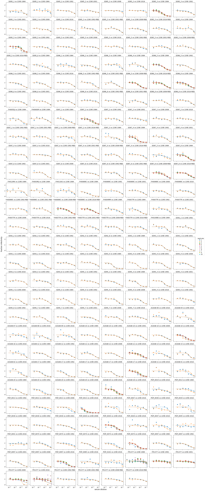
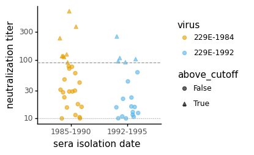
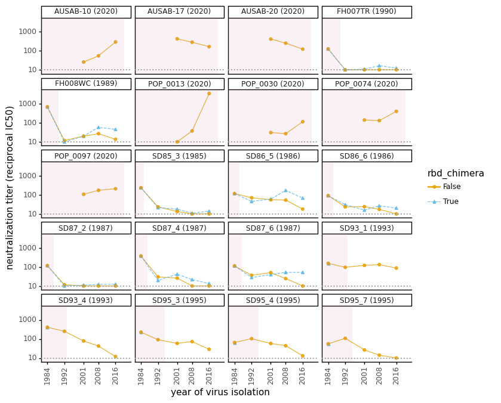

# Analyze neutralization data
This Python Jupyter notebook analyzes the neutralization data.

Import Python modules.
We use [neutcurve](https://jbloomlab.github.io/neutcurve/) to plot the neutralization curves:


```python
import math
import re
import warnings

from IPython.display import display, HTML

import matplotlib.pyplot as plt

import neutcurve
from neutcurve.colorschemes import CBPALETTE
from neutcurve.colorschemes import CBMARKERS

import pandas as pd

from plotnine import *

print(f"Using `neutcurve` version {neutcurve.__version__}")
```

    Using `neutcurve` version 0.5.1


Specify input / output files:


```python
# input files
fracinfect_file = 'results/fracinfect.csv'
serum_info_file = 'serum_info.csv'

# output files
all_replicate_curves = 'results/all_neut_replicates.pdf'
all_neut_by_sera_curves = 'results/all_neut_by_sera.pdf'
all_fit_params = 'results/all_fit_params.csv'
all_neut_titers = 'results/all_neut_titers.csv'
```

Read in the neutralization data, dropping sera labeled as "Nothing":


```python
print(f"Reading neutralization data from {fracinfect_file}")
fracinfect = pd.read_csv(fracinfect_file)

# Input data restarts replicate numbers for each new date. Instead label replicates as:
#  - replicate_on_date: number of the replicate on that specific date
#  - replicate_with_date: number of replicate on that date suffixed by date
#  - replicate_all_dates: number replicates sequentially across all dates
fracinfect = (
    fracinfect
    .query('serum != "Nothing"')
    .assign(replicate_with_date=lambda x: x['replicate'].astype(str) +
                                          ' (' + x['date'] + ')')
    .rename(columns={'replicate': 'replicate_on_date'})
    )
fracinfect = (
    fracinfect
    .merge(fracinfect
           .sort_values('date')
           [['serum', 'virus', 'replicate_with_date']]
           .drop_duplicates()
           .assign(replicate_all_dates=lambda x: x.groupby(['serum', 'virus'])
                                                  ['replicate_with_date']
                                                  .transform('cumcount') + 1
                   ),
            how='left', on=['serum', 'virus', 'replicate_with_date'], validate='many_to_one',
            )
    )

# make sure unique reading for each virus / serum / replicate / date
assert len(fracinfect) == len(fracinfect.groupby(['serum',
                                                  'virus',
                                                  'replicate_all_dates',
                                                  'concentration',
                                                  ]))

# order the viruses
virus_order = ['229E-1984', '229E-1992', '229E-2001', '229E-2008', '229E-2016']
fracinfect = (
    fracinfect
    .assign(virus=lambda x: pd.Categorical(x['virus'], virus_order, ordered=True))
    .sort_values(['serum', 'virus', 'date'])
    )

# show first few lines of data frame
display(HTML(fracinfect.head().to_html(index=False)))
```

    Reading neutralization data from results/fracinfect.csv


<table border="1" class="dataframe">
  <thead>
    <tr style="text-align: right;">
      <th>serum</th>
      <th>virus</th>
      <th>replicate_on_date</th>
      <th>concentration</th>
      <th>fraction infectivity</th>
      <th>date</th>
      <th>replicate_with_date</th>
      <th>replicate_all_dates</th>
    </tr>
  </thead>
  <tbody>
    <tr>
      <td>FH003MJ</td>
      <td>229E-1984</td>
      <td>1</td>
      <td>0.100000</td>
      <td>0.1043</td>
      <td>2020-10-02</td>
      <td>1 (2020-10-02)</td>
      <td>2</td>
    </tr>
    <tr>
      <td>FH003MJ</td>
      <td>229E-1984</td>
      <td>1</td>
      <td>0.033330</td>
      <td>0.3108</td>
      <td>2020-10-02</td>
      <td>1 (2020-10-02)</td>
      <td>2</td>
    </tr>
    <tr>
      <td>FH003MJ</td>
      <td>229E-1984</td>
      <td>1</td>
      <td>0.011110</td>
      <td>0.4958</td>
      <td>2020-10-02</td>
      <td>1 (2020-10-02)</td>
      <td>2</td>
    </tr>
    <tr>
      <td>FH003MJ</td>
      <td>229E-1984</td>
      <td>1</td>
      <td>0.003704</td>
      <td>1.1130</td>
      <td>2020-10-02</td>
      <td>1 (2020-10-02)</td>
      <td>2</td>
    </tr>
    <tr>
      <td>FH003MJ</td>
      <td>229E-1984</td>
      <td>1</td>
      <td>0.001235</td>
      <td>0.7447</td>
      <td>2020-10-02</td>
      <td>1 (2020-10-02)</td>
      <td>2</td>
    </tr>
  </tbody>
</table>


Get information on sera:


```python
serum_info = (
    pd.read_csv(serum_info_file)
    .assign(collection_date=lambda x: pd.to_datetime(x['collection_date']),
            collection_year=lambda x: x['collection_date'].dt.year +
                                      (x['collection_date'].dt.dayofyear - 1) / 365,
            collection_year_round=lambda x: x['collection_year']
                                            .map(lambda y: str(int(round(y)))
                                                           if pd.notnull(y)
                                                           else 'unknown'),
            serum_year=lambda x: x.apply(lambda r: f"{r['serum']} ({r['collection_year_round']})",
                                         axis=1)
            )
    .sort_values('collection_date')
    )
    
assert len(serum_info) == serum_info['serum'].nunique()
print(f"Read information for {len(serum_info)} sera")

sera_lacking_info = set(fracinfect['serum']) - set(serum_info['serum'])
if sera_lacking_info:
    raise ValueError(f"lacking information for these sera: {sera_lacking_info}")

# show first few lines of sera information data frame:
display(HTML(serum_info.head().to_html(index=False)))
```

    Read information for 47 sera


<table border="1" class="dataframe">
  <thead>
    <tr style="text-align: right;">
      <th>serum</th>
      <th>collection_date</th>
      <th>age</th>
      <th>category</th>
      <th>notes</th>
      <th>collection_year</th>
      <th>collection_year_round</th>
      <th>serum_year</th>
    </tr>
  </thead>
  <tbody>
    <tr>
      <td>SD85_1</td>
      <td>1985-01-03</td>
      <td>27</td>
      <td>human</td>
      <td>sera</td>
      <td>1985.005479</td>
      <td>1985</td>
      <td>SD85_1 (1985)</td>
    </tr>
    <tr>
      <td>SD85_2</td>
      <td>1985-01-08</td>
      <td>20</td>
      <td>human</td>
      <td>sera</td>
      <td>1985.019178</td>
      <td>1985</td>
      <td>SD85_2 (1985)</td>
    </tr>
    <tr>
      <td>SD85_3</td>
      <td>1985-04-10</td>
      <td>26</td>
      <td>human</td>
      <td>sera</td>
      <td>1985.271233</td>
      <td>1985</td>
      <td>SD85_3 (1985)</td>
    </tr>
    <tr>
      <td>SD85_4</td>
      <td>1985-04-11</td>
      <td>23</td>
      <td>human</td>
      <td>sera</td>
      <td>1985.273973</td>
      <td>1985</td>
      <td>SD85_4 (1985)</td>
    </tr>
    <tr>
      <td>SD85_5</td>
      <td>1985-04-18</td>
      <td>23</td>
      <td>human</td>
      <td>sera</td>
      <td>1985.293151</td>
      <td>1985</td>
      <td>SD85_5 (1985)</td>
    </tr>
  </tbody>
</table>


Use [neutcurve](https://jbloomlab.github.io/neutcurve/) to fit neutralization curves to all of the data:


```python
fits = neutcurve.curvefits.CurveFits(
            data=fracinfect,
            replicate_col='replicate_all_dates',
            fixbottom=0,
            fixtop=1,
            )
```

Plot all curves for all replicates of all virus / serum combinations:


```python
with warnings.catch_warnings():
    warnings.simplefilter('ignore')  # ignore fitting warnings
    fig, _ = fits.plotReplicates(ncol=8,
                                 legendtitle='replicate',
                                 xlabel='serum dilution',
                                 sera=serum_info['serum'],
                                 viruses=fracinfect['virus'].sort_values().unique(),
                                 )
    
print(f"Saving plot to {all_replicate_curves}\n")
fig.savefig(all_replicate_curves)
fig.tight_layout()
display(fig)
plt.close(fig)
```

    Saving plot to results/all_neut_replicates.pdf
    


    

    


Make a plot showing all viruses against each sera:


```python
fig, _ = fits.plotSera(xlabel='serum dilution',
                       ncol=6,
                       legendtitle='virus',
                       viruses=fracinfect['virus'].sort_values().unique(),
                       sera=serum_info['serum'],
                       titles=serum_info['serum_year'],
                       )

print(f"Saving plot to {all_neut_by_sera_curves}\n")
fig.savefig(all_neut_by_sera_curves)
fig.tight_layout()
display(fig)
plt.close(fig)
```

    /fh/fast/bloom_j/software/miniconda3/envs/CoV_229E_antigenic_drift/lib/python3.8/site-packages/neutcurve/hillcurve.py:689: RuntimeWarning: invalid value encountered in power


    Saving plot to results/all_neut_by_sera.pdf
    


    

    


Write all of the fit parameters to a file:


```python
print(f"Writing all fit parameters to {all_fit_params}; first few lines also printed below:")

display(HTML(fits.fitParams().head().to_html(index=False)))

fits.fitParams().to_csv(all_fit_params, index=False)
```

    Writing all fit parameters to results/all_fit_params.csv; first few lines also printed below:


<table border="1" class="dataframe">
  <thead>
    <tr style="text-align: right;">
      <th>serum</th>
      <th>virus</th>
      <th>replicate</th>
      <th>nreplicates</th>
      <th>ic50</th>
      <th>ic50_bound</th>
      <th>ic50_str</th>
      <th>midpoint</th>
      <th>slope</th>
      <th>top</th>
      <th>bottom</th>
    </tr>
  </thead>
  <tbody>
    <tr>
      <td>FH003MJ</td>
      <td>229E-1984</td>
      <td>average</td>
      <td>2</td>
      <td>0.016790</td>
      <td>interpolated</td>
      <td>0.0168</td>
      <td>0.016790</td>
      <td>1.635237</td>
      <td>1</td>
      <td>0</td>
    </tr>
    <tr>
      <td>FH004MM</td>
      <td>229E-1984</td>
      <td>average</td>
      <td>2</td>
      <td>0.034620</td>
      <td>interpolated</td>
      <td>0.0346</td>
      <td>0.034620</td>
      <td>0.963866</td>
      <td>1</td>
      <td>0</td>
    </tr>
    <tr>
      <td>FH005DJ</td>
      <td>229E-1984</td>
      <td>average</td>
      <td>2</td>
      <td>0.014059</td>
      <td>interpolated</td>
      <td>0.0141</td>
      <td>0.014059</td>
      <td>1.289468</td>
      <td>1</td>
      <td>0</td>
    </tr>
    <tr>
      <td>FH006SM</td>
      <td>229E-1984</td>
      <td>average</td>
      <td>2</td>
      <td>0.063402</td>
      <td>interpolated</td>
      <td>0.0634</td>
      <td>0.063402</td>
      <td>1.324233</td>
      <td>1</td>
      <td>0</td>
    </tr>
    <tr>
      <td>FH007TR</td>
      <td>229E-1984</td>
      <td>average</td>
      <td>2</td>
      <td>0.008009</td>
      <td>interpolated</td>
      <td>0.00801</td>
      <td>0.008009</td>
      <td>1.074526</td>
      <td>1</td>
      <td>0</td>
    </tr>
  </tbody>
</table>


Get neutralization titers, and merge them with information on the sera:


```python
neut_titers = (
    fits.fitParams()
    .assign(neut_titer=lambda x: 1 / x['ic50'])
    .assign(is_upper_bound=lambda x: x['ic50_bound'].map({'lower': True,
                                                          'interpolated': False}))
    [['serum', 'virus', 'neut_titer', 'is_upper_bound']]
    .merge(serum_info[['serum', 'serum_year', 'collection_date', 'collection_year', 'age']],
           how='left', validate='many_to_one', on='serum')
    )

print(f"Writing neut titers to {all_neut_titers}; first few lines also printed below:")

display(HTML(neut_titers.head().to_html(index=False, float_format='%.1f')))

neut_titers.to_csv(all_neut_titers, index=False, float_format='%.1f')
```

    Writing neut titers to results/all_neut_titers.csv; first few lines also printed below:


<table border="1" class="dataframe">
  <thead>
    <tr style="text-align: right;">
      <th>serum</th>
      <th>virus</th>
      <th>neut_titer</th>
      <th>is_upper_bound</th>
      <th>serum_year</th>
      <th>collection_date</th>
      <th>collection_year</th>
      <th>age</th>
    </tr>
  </thead>
  <tbody>
    <tr>
      <td>FH003MJ</td>
      <td>229E-1984</td>
      <td>59.6</td>
      <td>False</td>
      <td>FH003MJ (1988)</td>
      <td>1987-11-09</td>
      <td>1987.9</td>
      <td>&lt;40</td>
    </tr>
    <tr>
      <td>FH004MM</td>
      <td>229E-1984</td>
      <td>28.9</td>
      <td>False</td>
      <td>FH004MM (1989)</td>
      <td>1989-06-26</td>
      <td>1989.5</td>
      <td>&lt;40</td>
    </tr>
    <tr>
      <td>FH005DJ</td>
      <td>229E-1984</td>
      <td>71.1</td>
      <td>False</td>
      <td>FH005DJ (1987)</td>
      <td>1986-10-06</td>
      <td>1986.8</td>
      <td>66</td>
    </tr>
    <tr>
      <td>FH006SM</td>
      <td>229E-1984</td>
      <td>15.8</td>
      <td>False</td>
      <td>FH006SM (1987)</td>
      <td>1986-12-20</td>
      <td>1987.0</td>
      <td>&lt;40</td>
    </tr>
    <tr>
      <td>FH007TR</td>
      <td>229E-1984</td>
      <td>124.9</td>
      <td>False</td>
      <td>FH007TR (1990)</td>
      <td>1989-08-29</td>
      <td>1989.7</td>
      <td>28</td>
    </tr>
  </tbody>
</table>


Now for plotting annotate neut titers with information about:
 - virus year
 - the "closest" virus for each sera, which is the most recent virus isolated no later than the sera collection year


```python
def get_virus_year(virus):
    m = re.fullmatch('229E\-(?P<year>\d{4})', virus)
    if not m:
        raise ValueError(f"cannot match virus year in {virus}")
    else:
        return int(m.group('year'))

annotated_neut_titers = (
    neut_titers
    .assign(virus_year=lambda x: x['virus'].map(get_virus_year))
    )

annotated_neut_titers = (
    annotated_neut_titers
    .merge(annotated_neut_titers.sort_values('collection_year')
                                .query('collection_date.dt.year >= virus_year')
                                .groupby('serum', as_index=False)
                                .aggregate(closest_virus_year=pd.NamedAgg('virus_year', 'last'),
                                           closest_virus=pd.NamedAgg('virus', 'last')
                                           ),
           how='left', on='serum')
    .assign(closest_virus_year=lambda x: x['closest_virus_year'].astype('Int64'))
    )
```

Get lower bound for neutralization titers and make sure consistent across all samples:


```python
titer_lower_bound = neut_titers.query('is_upper_bound')['neut_titer'].min()

print(f"The lower bound on measurable neutralization titers is {titer_lower_bound}")

assert (neut_titers.query('is_upper_bound')['neut_titer'] == titer_lower_bound).all()
```

    The lower bound on measurable neutralization titers is 10.0


Set titer cutoff for samples that are analyzed against additional years:


```python
titer_cutoff = 90
```

Plot distribution of titers for each sera against it's "closest" virus:


```python
closest_virus_df = pd.DataFrame()
for closest_virus_year, df in annotated_neut_titers.groupby('closest_virus_year'):
    assert df['closest_virus'].nunique() == 1, df['closest_virus'].unique()
    closest_virus = df['closest_virus'].unique().tolist()[0]
    earliest_sera = df['collection_year'].round().sort_values().astype(int).tolist()[0]
    latest_sera = df['collection_year'].round().sort_values().astype(int).tolist()[-1]
    
    df_closest = (
        df
        .query('virus_year == @closest_virus_year')
        [['serum', 'virus', 'collection_date', 'age', 'neut_titer', 'is_upper_bound']]
        .sort_values('neut_titer', ascending=False)
        .assign(sera_range=f"{earliest_sera}-{latest_sera}",
                titer_to_closest_virus=lambda x: x['neut_titer'],
                closest_virus=closest_virus)
        )
    closest_virus_df = closest_virus_df.append(df_closest)
    
    above_cutoff = df_closest.query('neut_titer > @titer_cutoff')
    
    print(f"\nThere are {len(df_closest)} sera with a most recent closest virus of {closest_virus}.\n"
          f"These sera were collected between {earliest_sera} and {latest_sera}.\n"
          f"{len(above_cutoff)} of the {len(df_closest)} sera have neut titers >{titer_cutoff}:")
    display(HTML(above_cutoff
                 .drop(columns=['closest_virus', 'titer_to_closest_virus'])
                 .to_html(index=False, float_format='%.1f')
                 ))
    
print('\nDistribution of titers of sera against its most recent closest virus:')
p = (ggplot(closest_virus_df.assign(above_cutoff=lambda x: x['neut_titer'] > titer_cutoff)) +
     aes('sera_range', 'neut_titer', color='virus', shape='above_cutoff') +
     geom_jitter(height=0, width=0.2, size=2,
                 alpha=0.6, random_state=1) +
     theme_classic() +
     theme(figure_size=(1.3 * closest_virus_df['virus'].nunique(), 2.5),
           ) +
     scale_y_log10(name='neutralization titer') +
     scale_color_manual(values=CBPALETTE[1:]) +
     xlab('sera isolation date') +
     geom_hline(yintercept=titer_lower_bound, linetype='dotted', color=CBPALETTE[0]) +
     geom_hline(yintercept=titer_cutoff, linetype='dashed', color=CBPALETTE[0])
     )
_ = p.draw()
```

    
    There are 27 sera with a most recent closest virus of 229E-1984.
    These sera were collected between 1985 and 1990.
    9 of the 27 sera have neut titers >90:


<table border="1" class="dataframe">
  <thead>
    <tr style="text-align: right;">
      <th>serum</th>
      <th>virus</th>
      <th>collection_date</th>
      <th>age</th>
      <th>neut_titer</th>
      <th>is_upper_bound</th>
      <th>sera_range</th>
    </tr>
  </thead>
  <tbody>
    <tr>
      <td>FH008WC</td>
      <td>229E-1984</td>
      <td>1989-02-06</td>
      <td>unknown</td>
      <td>684.4</td>
      <td>False</td>
      <td>1985-1990</td>
    </tr>
    <tr>
      <td>SD87_4</td>
      <td>229E-1984</td>
      <td>1987-03-16</td>
      <td>22</td>
      <td>370.3</td>
      <td>False</td>
      <td>1985-1990</td>
    </tr>
    <tr>
      <td>SD85_3</td>
      <td>229E-1984</td>
      <td>1985-04-10</td>
      <td>26</td>
      <td>330.2</td>
      <td>False</td>
      <td>1985-1990</td>
    </tr>
    <tr>
      <td>SD87_2</td>
      <td>229E-1984</td>
      <td>1987-01-22</td>
      <td>24</td>
      <td>170.5</td>
      <td>False</td>
      <td>1985-1990</td>
    </tr>
    <tr>
      <td>SD86_5</td>
      <td>229E-1984</td>
      <td>1986-03-10</td>
      <td>35</td>
      <td>131.7</td>
      <td>False</td>
      <td>1985-1990</td>
    </tr>
    <tr>
      <td>FH007TR</td>
      <td>229E-1984</td>
      <td>1989-08-29</td>
      <td>28</td>
      <td>124.9</td>
      <td>False</td>
      <td>1985-1990</td>
    </tr>
    <tr>
      <td>SD87_6</td>
      <td>229E-1984</td>
      <td>1987-04-30</td>
      <td>29</td>
      <td>117.0</td>
      <td>False</td>
      <td>1985-1990</td>
    </tr>
    <tr>
      <td>SD86_6</td>
      <td>229E-1984</td>
      <td>1986-04-10</td>
      <td>32</td>
      <td>109.7</td>
      <td>False</td>
      <td>1985-1990</td>
    </tr>
    <tr>
      <td>SD85_5</td>
      <td>229E-1984</td>
      <td>1985-04-18</td>
      <td>23</td>
      <td>106.9</td>
      <td>False</td>
      <td>1985-1990</td>
    </tr>
  </tbody>
</table>


    
    There are 19 sera with a most recent closest virus of 229E-1992.
    These sera were collected between 1992 and 1995.
    5 of the 19 sera have neut titers >90:


<table border="1" class="dataframe">
  <thead>
    <tr style="text-align: right;">
      <th>serum</th>
      <th>virus</th>
      <th>collection_date</th>
      <th>age</th>
      <th>neut_titer</th>
      <th>is_upper_bound</th>
      <th>sera_range</th>
    </tr>
  </thead>
  <tbody>
    <tr>
      <td>SD93_4</td>
      <td>229E-1992</td>
      <td>1993-03-15</td>
      <td>20</td>
      <td>252.5</td>
      <td>False</td>
      <td>1992-1995</td>
    </tr>
    <tr>
      <td>SD95_7</td>
      <td>229E-1992</td>
      <td>1995-04-07</td>
      <td>12</td>
      <td>108.1</td>
      <td>False</td>
      <td>1992-1995</td>
    </tr>
    <tr>
      <td>SD95_4</td>
      <td>229E-1992</td>
      <td>1995-02-28</td>
      <td>unknown</td>
      <td>103.5</td>
      <td>False</td>
      <td>1992-1995</td>
    </tr>
    <tr>
      <td>SD93_1</td>
      <td>229E-1992</td>
      <td>1993-01-22</td>
      <td>unknown</td>
      <td>95.1</td>
      <td>False</td>
      <td>1992-1995</td>
    </tr>
    <tr>
      <td>SD95_3</td>
      <td>229E-1992</td>
      <td>1995-02-21</td>
      <td>unknown</td>
      <td>91.6</td>
      <td>False</td>
      <td>1992-1995</td>
    </tr>
  </tbody>
</table>


    
    Distribution of titers of sera against its most recent closest virus:


    

    


Now plot neutralization titers as a function of virus isolation date for all viruses with a titer against the 1984 virus of at least 100.


```python
df = (annotated_neut_titers
      .merge(closest_virus_df[['serum', 'closest_virus', 'sera_range', 'titer_to_closest_virus']],
             on='serum')
      .query('titer_to_closest_virus > @titer_cutoff')
      )

ncol = 4
nfacets = df['serum_year'].nunique()
nrow = math.ceil(nfacets / ncol)

p = (
    ggplot(df) +
    aes(x='virus_year', y='neut_titer', color='sera_range') +
    geom_point() +
    geom_line() +
    facet_wrap('~ serum_year',
               ncol=ncol,
               nrow=nrow) +
    scale_y_log10(name='neutralization titer (reciprocal IC50)',
                  expand=(0.08, 0),
                  ) +
    scale_x_continuous(name='year of virus isolation',
                      breaks=df['virus_year'].sort_values().unique(),
                      expand=(0.08, 0),
                      ) +
    theme_classic() +
    geom_rect(data=df[['serum_year', 'collection_year']].drop_duplicates(),
              mapping=aes(xmax='collection_year'),
              inherit_aes=False,
              xmin=0, ymin=0, ymax=100, fill=CBPALETTE[-1], alpha=0.1) +
    scale_color_manual(values=CBPALETTE[1:]) +
    theme(axis_text_x=element_text(angle=90),
          figure_size=(2 * ncol, 1.5 * nrow)) +
    geom_hline(yintercept=titer_lower_bound, linetype='dotted', color=CBPALETTE[0], size=0.75)
    )

_ = p.draw()
```


    

    


```python

```
