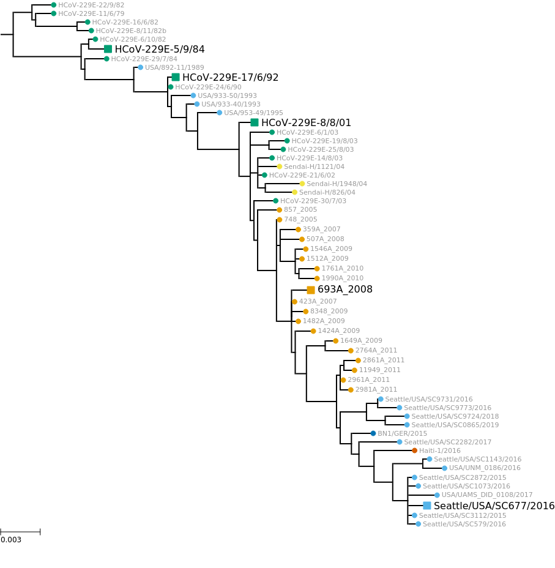
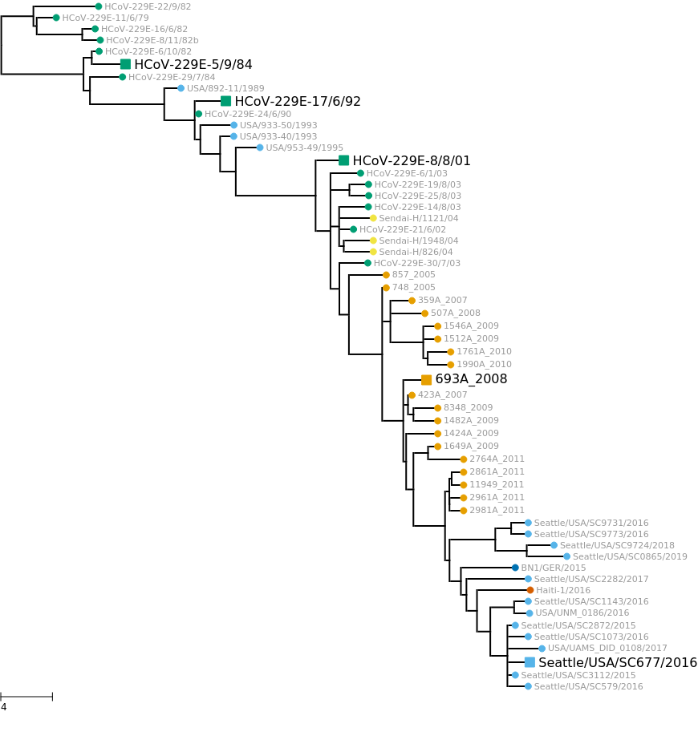

# Draw phylogenetic trees
This Python Jupyter notebook visualizes the Spike phylogenetic trees.

## Imports and configuration
Import modules and read configuration file:


```python
import collections
import os
import io

import ete3

from IPython.display import display, HTML

import matplotlib
import matplotlib.pyplot as plt

import pandas as pd

import yaml
```

    /fh/fast/bloom_j/software/miniconda3/envs/CoV_229E_antigenic_drift/lib/python3.8/site-packages/ete3-3.1.2-py3.7.egg/ete3/evol/parser/codemlparser.py:221: SyntaxWarning: "is" with a literal. Did you mean "=="?
    /fh/fast/bloom_j/software/miniconda3/envs/CoV_229E_antigenic_drift/lib/python3.8/site-packages/ete3-3.1.2-py3.7.egg/ete3/evol/parser/codemlparser.py:221: SyntaxWarning: "is" with a literal. Did you mean "=="?


Read configuration:


```python
with open('config.yaml') as f:
    config = yaml.safe_load(f)
    
os.makedirs(config['tree_dir'], exist_ok=True)
```

Read various metadata:


```python
metadata = pd.read_csv(config['spikes_metadata'])
```

Color-blind palette:


```python
cbPalette = ("#999999", "#E69F00", "#56B4E9", "#009E73", "#F0E442", "#0072B2", "#D55E00", "#CC79A7")
```

## Draw phylogenetic trees
We will color nodes by the country of isolation, so first map country to color:


```python
# map country and strain name to color
country_to_color = dict(zip(metadata.groupby('country')
                                    .aggregate(count=pd.NamedAgg('name', 'count'))
                                    .sort_values('count', ascending=False)
                                    .index,
                             cbPalette[1:]))
name_to_country = metadata.set_index('name')['country'].to_dict()

# draw a legend for the country to color mapping
# for circles: https://stackoverflow.com/a/44113141
patches = [plt.plot([], [], marker='o', ms=10, ls='', color=color, label=country)[0]
           for country, color in country_to_color.items()]
plt.gca().set_axis_off()
legend = plt.legend(handles=patches,
                    loc='center',
                    frameon=False,
                    prop={'family': 'DejaVu Sans'})
# draw just legend https://stackoverflow.com/a/47749903
print(f"Saving legend to {config['tree_legend']}")
fig = legend.figure
fig.canvas.draw()
bbox = legend.get_window_extent().transformed(fig.dpi_scale_trans.inverted())
fig.savefig(config['tree_legend'], bbox_inches=bbox)
```

    Saving legend to results/tree/legend.pdf


    

    


Identify strains we specially annotate as they are being used in experiments:


```python
with open(config['accessions_special']) as f:
    acc_to_annotate = yaml.safe_load(f)['annotate']
    
assert set(acc_to_annotate).issubset(set(metadata['Accession']))

print('Full details on annotated strains:')
display(HTML(metadata
             .query('Accession in @acc_to_annotate')
             .to_html(index=False)
             ))

names_to_annotate = metadata.query('Accession in @acc_to_annotate')['name'].tolist()
```

    Full details on annotated strains:


<table border="1" class="dataframe">
  <thead>
    <tr style="text-align: right;">
      <th>name</th>
      <th>date</th>
      <th>year</th>
      <th>Accession</th>
      <th>Authors</th>
      <th>Geo_Location</th>
      <th>country</th>
      <th>collection_date</th>
      <th>GenBank_Title</th>
      <th>n_redundant_seqs</th>
    </tr>
  </thead>
  <tbody>
    <tr>
      <td>HCoV-229E-5/9/84</td>
      <td>1984.679452</td>
      <td>1984</td>
      <td>DQ243972</td>
      <td>Chibo,D., Birch,C., Birch,C.J.</td>
      <td>Australia</td>
      <td>Australia</td>
      <td>1984-09-05</td>
      <td>Human coronavirus 229E isolate HCoV-229E-5/9/84 spike glycoprotein (S) gene, complete cds</td>
      <td>1</td>
    </tr>
    <tr>
      <td>HCoV-229E-17/6/92</td>
      <td>1992.460274</td>
      <td>1992</td>
      <td>DQ243976</td>
      <td>Chibo,D., Birch,C., Birch,C.J.</td>
      <td>Australia</td>
      <td>Australia</td>
      <td>1992-06-17</td>
      <td>Human coronavirus 229E isolate HCoV-229E-17/6/92 spike glycoprotein (S) gene, complete cds</td>
      <td>1</td>
    </tr>
    <tr>
      <td>HCoV-229E-8/8/01</td>
      <td>2001.600000</td>
      <td>2001</td>
      <td>DQ243977</td>
      <td>Chibo,D., Birch,C., Birch,C.J.</td>
      <td>Australia</td>
      <td>Australia</td>
      <td>2001-08-08</td>
      <td>Human coronavirus 229E strain HCoV-229E-8/8/01 spike glycoprotein (S) gene, complete cds</td>
      <td>2</td>
    </tr>
    <tr>
      <td>693A_2008</td>
      <td>2008.000000</td>
      <td>2008</td>
      <td>KM055556</td>
      <td>Zhang,Y., Ren,L., Wang,J.</td>
      <td>China</td>
      <td>China</td>
      <td>2008-01-01</td>
      <td>Human coronavirus 229E isolate 693A_2008 spike glycoprotein (S) gene, complete cds</td>
      <td>1</td>
    </tr>
    <tr>
      <td>Seattle/USA/SC677/2016</td>
      <td>2016.000000</td>
      <td>2016</td>
      <td>KY369909</td>
      <td>Greninger,A.L., Makhsous,N., Kuypers,J.M., Shean,R.C., Jerome,K.R.</td>
      <td>USA</td>
      <td>USA</td>
      <td>2016-01-01</td>
      <td>Human coronavirus 229E strain HCoV_229E/Seattle/USA/SC677/2016, complete genome</td>
      <td>3</td>
    </tr>
  </tbody>
</table>


Read and draw the both the divergence and time trees using [ete3](http://etetoolkit.org/):


```python
# function to create and style tree
def get_pretty_tree(treefile,
                    widthscale=700,
                    heightscale=5,
                    ):
    """Returns `(tree, tree_style)`."""
    
    t = ete3.Tree(treefile, format=1)
    
    ts = ete3.TreeStyle()
    ts.show_leaf_name = False  # add tip names manually
    height = t.get_farthest_node()[1]
    ts.scale = widthscale / height
    ts.branch_vertical_margin = heightscale
    
    name_to_color = {name: country_to_color[country] for name, country in name_to_country.items()}
    
    for n in t.traverse():
        nstyle = ete3.NodeStyle()
        nstyle['hz_line_width'] = 2
        nstyle['vt_line_width'] = 2
        nstyle['hz_line_color'] = 'black'
        nstyle['vt_line_color'] = 'black'
        if n.is_leaf():
            nstyle['fgcolor'] = name_to_color[n.name]
            if n.name in names_to_annotate:
                nstyle['size'] = 12
                nstyle['shape'] = 'square'
            else:
                nstyle['size'] = 8
            n.add_face(ete3.TextFace(f" {n.name}",
                                     ftype='Dejavu Sans',
                                     tight_text=True,
                                     fsize=12 if n.name in names_to_annotate else 8,
                                     fgcolor='black' if n.name in names_to_annotate else cbPalette[0],
                                     ),
                       column=0,
                       position='branch-right')
        else:
            nstyle['size'] = 0
        n.set_style(nstyle)
        
    # scale bar: https://github.com/etetoolkit/ete/issues/266
    bar_length = float(f"{height / 10:.1g}")
    ts.scale_length = bar_length
         
    return t, ts
    

for branch_len in ['divergence', 'time']:
    
    treefile = config[f"{branch_len}tree"]
    tree_image = config[f"{branch_len}tree_image"]
    print(f"\nReading {branch_len} tree from {treefile} and drawing to {tree_image}")
    t, ts = get_pretty_tree(treefile)
    display(t.render('%%inline', tree_style=ts))
    t.render(tree_image, tree_style=ts)

```

    
    Reading divergence tree from results/timetree/divergence_tree.newick and drawing to results/tree/divergence_tree.pdf


    

    


    
    Reading time tree from results/timetree/timetree.newick and drawing to results/tree/timetree.pdf


    

    


```python

```
