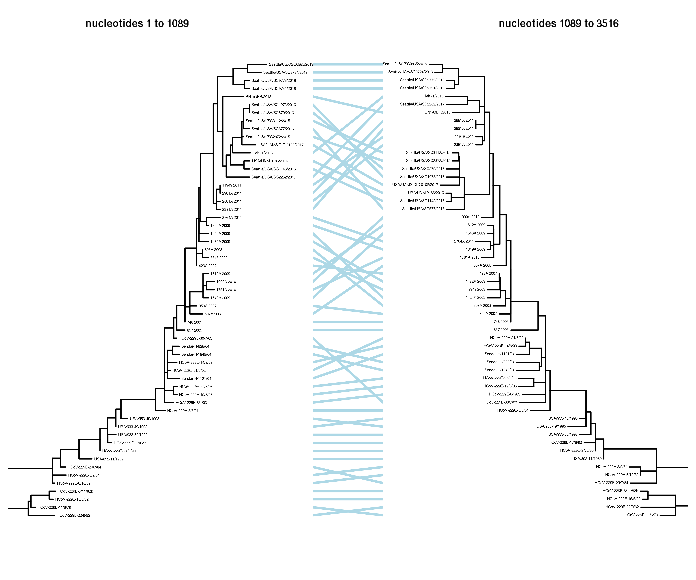

# Process `GARD` results and create tanglegram
Running `GARD` has identified recombination breakpoints.
This Python Jupyter notebook analyses the `GARD` results and draws a tanglegram.
This is done under the assumption there is just one breakpoint (an error will be raised if there is more than one).

Import modules:


```python
import json
import io
import os
import re
import subprocess

import Bio.Phylo
import Bio.SeqIO

from IPython.display import display, Image

import pandas as pd

import rpy2.robjects

import yaml
```

Read the configuration:


```python
with open('config.yaml') as f:
    config = yaml.safe_load(f)
```

Make output directory:


```python
os.makedirs(config['gard_analysis_dir'], exist_ok=True)
```

`GARD` output a JSON that defines the results and breakpoints.
Read these results:


```python
print(f"Reading GARD results from {config['gard_recomb_json']}")

with open(config['gard_recomb_json']) as f:
    gard_results = json.load(f)
```

    Reading GARD results from results/gard_recomb.json


Process the results under the assumption that GARD found a single breakpoint and therefore two partitions each with a corresponding tree.
Determine the location of the breakpoint and how much it improves AIC, as well as the Newick strings for the tree for each partition.
If there is not a single improved model with a single breakpoint, raise an error as the subsequent code will not work in that case:


```python
if len(gard_results['improvements']) == 1:
    breakpoint = gard_results['improvements']['0']['breakpoints'][0][0]
    deltaAIC = gard_results['improvements']['0']['deltaAICc']
    print(f"Found one breakpoint at nucleotide {breakpoint} that increases AIC by {deltaAIC:.2f}")
else:
    raise ValueError('Failed to find exactly one improvement')
    
gard_partitions = gard_results['breakpointData']
if len(gard_partitions) == 2:
    newicks_gard = [val['tree'] for val in gard_partitions.values()]
else:
    raise ValueError('Not exactly one breakpoint (two partitions)')
```

    Found one breakpoint at nucleotide 1089 that increases AIC by 60.31


`GARD` has annoying renamed the nodes by substituting underscores for all special characters.
Here we get rid of the internal node names and re-name tips back to the original full taxa name:


```python
names = pd.read_csv(config['spikes_metadata'])['name'].tolist()

newicks = []
for newick in newicks_gard:
    tree = Bio.Phylo.read(io.StringIO(newick), 'newick')
    for n in tree.get_nonterminals():
        n.name = None
    for n in tree.get_terminals():
        name_gard = n.name.replace('_', '.')
        name_match = [name for name in names if re.fullmatch(name_gard, name)]
        if len(name_match) != 1:
            raise ValueError(f"Found {len(name_match)} name matches for {name_gard}")
        n.name = name_match[0]
    newicks.append(tree.format('newick'))
```

Now write the trees to Newick files and run [timetree](https://treetime.readthedocs.io/) on them to get time-tree rooted versions:


```python
timetree_newicks = []

alignment = list(Bio.SeqIO.parse(config['spikes_aligned_codon'], 'fasta'))

for i, newick in enumerate(newicks, start=1):
    
    outdir = os.path.join(config['gard_analysis_dir'], f"partition_{i}")
    print(f"\n\nRunning `treetime` for partition {i} in {outdir}")
    os.makedirs(outdir, exist_ok=True)
    
    # create newick input file
    newick_file = os.path.join(outdir, 'tree.newick')
    with open(newick_file, 'w') as f:
        f.write(newick)
        
    # get alignment for partition
    aln_file = os.path.join(outdir, 'alignment.fasta')
    if i == 1:
        Bio.SeqIO.write([a[: breakpoint] for a in alignment], aln_file, 'fasta')
    elif i == 2:
        Bio.SeqIO.write([a[breakpoint:] for a in alignment], aln_file, 'fasta')
    else:
        raise ValueError('code assumes just one partition')
        
    # run timetree    
    cmds = ['treetime',
            '--aln', aln_file,
            '--dates', config['spikes_metadata'],
            '--tree', newick_file,
            '--outdir', outdir,
            '--verbose', '0',
            ]
    result = subprocess.run(cmds, check=True, capture_output=True)
    timetree = Bio.Phylo.read(os.path.join(outdir, 'timetree.nexus'), 'nexus')
    print(result.stdout.decode())
    newick = os.path.join(outdir, 'timetree.newick')
    print(f"Writing tree to {newick}")
    Bio.Phylo.write(timetree, newick, 'newick')
    timetree_newicks.append(newick)
```

    
    
    Running `treetime` for partition 1 in results/gard_analysis/partition_1
    
    Attempting to parse dates...
    	Using column 'name' as name. This needs match the taxon names in the tree!!
    	Using column 'date' as date.
    
    0.00	-TreeAnc: set-up
    
    0.08	WARNING: Previous versions of TreeTime (<0.7.0) RECONSTRUCTED sequences of
        	tips at positions with AMBIGUOUS bases. This resulted in unexpected
        	behavior is some cases and is no longer done by default. If you want to
        	replace those ambiguous sites with their most likely state, rerun with
        	`reconstruct_tip_states=True` or `--reconstruct-tip-states`.
    
    Inferred sequence evolution model (saved as results/gard_analysis/partition_1/sequence_evolution_model.txt):
    Substitution rate (mu): 1.0
    
    Equilibrium frequencies (pi_i):
      A: 0.2418
      C: 0.1768
      G: 0.1965
      T: 0.375
      -: 0.01
    
    Symmetrized rates from j->i (W_ij):
    	A	C	G	T	-
      A	0	1.5546	1.8153	0.4041	2.4436
      C	1.5546	0	1.0074	2.9192	0.8614
      G	1.8153	1.0074	0	0.8844	2.9491
      T	0.4041	2.9192	0.8844	0	2.8822
      -	2.4436	0.8614	2.9491	2.8822	0
    
    Actual rates from j->i (Q_ij):
    	A	C	G	T	-
      A	0	0.3759	0.4389	0.0977	0.5908
      C	0.2749	0	0.1781	0.5162	0.1523
      G	0.3566	0.1979	0	0.1737	0.5794
      T	0.1515	1.0946	0.3316	0	1.0807
      -	0.0244	0.0086	0.0294	0.0288	0
    
    
    Inferred sequence evolution model (saved as results/gard_analysis/partition_1/molecular_clock.txt):
    Root-Tip-Regression:
     --rate:	1.242e-03
     --r^2:  	0.95
    
    --- saved tree as 
    	 results/gard_analysis/partition_1/timetree.pdf
    
    --- root-to-tip plot saved to  
    	results/gard_analysis/partition_1/root_to_tip_regression.pdf
    
    --- alignment including ancestral nodes saved as  
    	 results/gard_analysis/partition_1/ancestral_sequences.fasta
    
    --- saved divergence times in 
    	 results/gard_analysis/partition_1/dates.tsv
    
    --- tree saved in nexus format as  
    	 results/gard_analysis/partition_1/timetree.nexus
    
    --- divergence tree saved in nexus format as  
    	 results/gard_analysis/partition_1/divergence_tree.nexus
    
    
    Writing tree to results/gard_analysis/partition_1/timetree.newick
    
    
    Running `treetime` for partition 2 in results/gard_analysis/partition_2
    
    Attempting to parse dates...
    	Using column 'name' as name. This needs match the taxon names in the tree!!
    	Using column 'date' as date.
    
    0.00	-TreeAnc: set-up
    
    0.18	WARNING: Previous versions of TreeTime (<0.7.0) RECONSTRUCTED sequences of
        	tips at positions with AMBIGUOUS bases. This resulted in unexpected
        	behavior is some cases and is no longer done by default. If you want to
        	replace those ambiguous sites with their most likely state, rerun with
        	`reconstruct_tip_states=True` or `--reconstruct-tip-states`.
    
    Inferred sequence evolution model (saved as results/gard_analysis/partition_2/sequence_evolution_model.txt):
    Substitution rate (mu): 1.0
    
    Equilibrium frequencies (pi_i):
      A: 0.2654
      C: 0.1789
      G: 0.2045
      T: 0.3413
      -: 0.0099
    
    Symmetrized rates from j->i (W_ij):
    	A	C	G	T	-
      A	0	0.7929	1.6601	0.3247	0.9872
      C	0.7929	0	0.4705	3.9112	0.9986
      G	1.6601	0.4705	0	1.1038	0.9959
      T	0.3247	3.9112	1.1038	0	0.9783
      -	0.9872	0.9986	0.9959	0.9783	0
    
    Actual rates from j->i (Q_ij):
    	A	C	G	T	-
      A	0	0.2104	0.4406	0.0862	0.262
      C	0.1418	0	0.0842	0.6996	0.1786
      G	0.3395	0.0962	0	0.2258	0.2037
      T	0.1108	1.3348	0.3767	0	0.3339
      -	0.0098	0.0099	0.0099	0.0097	0
    
    
    Inferred sequence evolution model (saved as results/gard_analysis/partition_2/molecular_clock.txt):
    Root-Tip-Regression:
     --rate:	3.929e-04
     --r^2:  	0.95
    
    --- saved tree as 
    	 results/gard_analysis/partition_2/timetree.pdf
    
    --- root-to-tip plot saved to  
    	results/gard_analysis/partition_2/root_to_tip_regression.pdf
    
    --- alignment including ancestral nodes saved as  
    	 results/gard_analysis/partition_2/ancestral_sequences.fasta
    
    --- saved divergence times in 
    	 results/gard_analysis/partition_2/dates.tsv
    
    --- tree saved in nexus format as  
    	 results/gard_analysis/partition_2/timetree.nexus
    
    --- divergence tree saved in nexus format as  
    	 results/gard_analysis/partition_2/divergence_tree.nexus
    
    
    Writing tree to results/gard_analysis/partition_2/timetree.newick


Use `rpy2` to read the tree into `dendextend`.
The use of `rpy2` is based loosely on [here](https://biopython.org/wiki/Phylo_cookbook).
The reading of trees into `dendextend` is based loosely on [here](https://stackoverflow.com/questions/62063675/how-to-use-dendextend-read-newick-phylogenetic-tree-for-tree-compare).
Then create a tanglegram as described [here](https://cran.r-project.org/web/packages/dendextend/vignettes/dendextend.html#tanglegram), untangle it, and plot it to a PNG:


```python
_ = rpy2.robjects.r(f"""
    library(dendextend)
    library(DECIPHER)
    
    dend1 <- ReadDendrogram('results/gard_analysis/partition_1/timetree.newick',
                            internalLabels=FALSE,
                            keepRoot=FALSE) %>%
             as.dendrogram
    dend2 <- ReadDendrogram('results/gard_analysis/partition_2/timetree.newick',
                            internalLabels=FALSE,
                            keepRoot=FALSE) %>%
             as.dendrogram
    dends <- dendlist(dend1, dend2)
    
    options(warn=-1)  # suppress a lot of warnings
    dends_untangled <- dends %>% untangle(method='step1side')
    options(warn=0)
    cat("entanglement went from",
        dends %>% entanglement,
        "to",
        dends_untangled %>% entanglement)
        
    png('{config['gard_tanglegram']}', width=6, height=5, res=750, units="in")
    dends_untangled %>% 
      tanglegram(main_left="nucleotides 1 to {breakpoint}",
                 main_right="nucleotides {breakpoint} to {len(alignment[0])}",
                 columns_width=c(4, 0.9, 4),
                 axes=FALSE,
                 highlight_distinct_edges=FALSE,
                 common_subtrees_color_lines=FALSE,
                 edge.lwd=1,
                 lwd=2,
                 color_lines="lightblue",
                 lab.cex=0.3,
                 cex_main_left=0.8,
                 cex_main_right=0.8,
                 )
    dev.off()    
    """)
```

    R[write to console]: 
    ---------------------
    Welcome to dendextend version 1.13.4
    Type citation('dendextend') for how to cite the package.
    
    Type browseVignettes(package = 'dendextend') for the package vignette.
    The github page is: https://github.com/talgalili/dendextend/
    
    Suggestions and bug-reports can be submitted at: https://github.com/talgalili/dendextend/issues
    Or contact: <tal.galili@gmail.com>
    
    	To suppress this message use:  suppressPackageStartupMessages(library(dendextend))
    ---------------------
    
    
    R[write to console]: 
    Attaching package: ‘dendextend’
    
    
    R[write to console]: The following object is masked from ‘package:stats’:
    
        cutree
    
    
    R[write to console]: Loading required package: Biostrings
    
    R[write to console]: Loading required package: BiocGenerics
    
    R[write to console]: Loading required package: parallel
    
    R[write to console]: 
    Attaching package: ‘BiocGenerics’
    
    
    R[write to console]: The following objects are masked from ‘package:parallel’:
    
        clusterApply, clusterApplyLB, clusterCall, clusterEvalQ,
        clusterExport, clusterMap, parApply, parCapply, parLapply,
        parLapplyLB, parRapply, parSapply, parSapplyLB
    
    
    R[write to console]: The following objects are masked from ‘package:stats’:
    
        IQR, mad, sd, var, xtabs
    
    
    R[write to console]: The following objects are masked from ‘package:base’:
    
        anyDuplicated, append, as.data.frame, basename, cbind, colnames,
        dirname, do.call, duplicated, eval, evalq, Filter, Find, get, grep,
        grepl, intersect, is.unsorted, lapply, Map, mapply, match, mget,
        order, paste, pmax, pmax.int, pmin, pmin.int, Position, rank,
        rbind, Reduce, rownames, sapply, setdiff, sort, table, tapply,
        union, unique, unsplit, which, which.max, which.min
    
    
    R[write to console]: Loading required package: S4Vectors
    
    R[write to console]: Loading required package: stats4
    
    R[write to console]: 
    Attaching package: ‘S4Vectors’
    
    
    R[write to console]: The following object is masked from ‘package:base’:
    
        expand.grid
    
    
    R[write to console]: Loading required package: IRanges
    
    R[write to console]: Loading required package: XVector
    
    R[write to console]: 
    Attaching package: ‘Biostrings’
    
    
    R[write to console]: The following object is masked from ‘package:dendextend’:
    
        nnodes
    
    
    R[write to console]: The following object is masked from ‘package:base’:
    
        strsplit
    
    
    R[write to console]: Loading required package: RSQLite
    


    entanglement went from 0.07710944 to 0.04783153

Display the tanglegram:


```python
print(f"Here is the tanglegram saved to {config['gard_tanglegram']}")
display(Image(config['gard_tanglegram']))
```

    Here is the tanglegram saved to results/gard_analysis/tanglegram.png





```python

```
