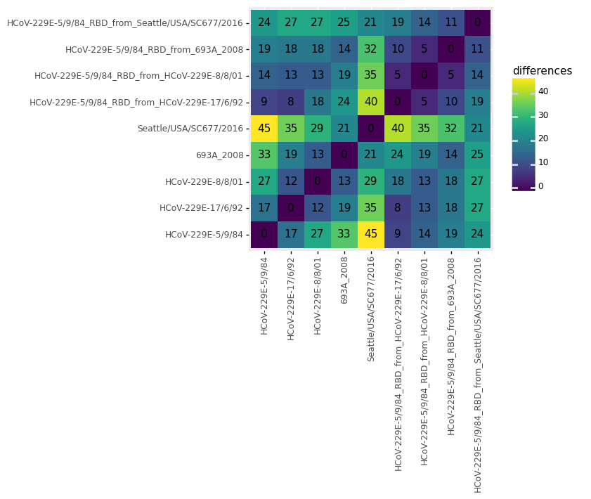
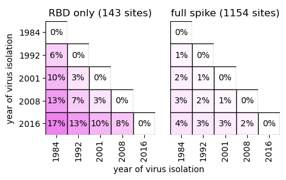

# Design Spike sequences for experiments
This Python Jupyter notebook designs plasmids for the Spikes designated for annotation in the configuration.

## Imports and configuration
Import modules and read configuration file:


```python
import copy
import itertools
import os

import Bio.Seq
import Bio.SeqFeature
import Bio.SeqIO
import Bio.SeqRecord

import dna_features_viewer

import editdistance

from IPython.display import display, HTML

import numpy

import pandas as pd

from plotnine import *

import pdb_prot_align.utils

import yaml
```

Read configuration:


```python
with open('config.yaml') as f:
    config = yaml.safe_load(f)
```

Make output directory:


```python
os.makedirs(config['seqs_for_expts_dir'], exist_ok=True)
```

## Get Spikes for experiments
Get names of Spikes for which we perform experiments as indicated in the configuration:


```python
metadata = pd.read_csv(config['spikes_metadata'])

with open(config['accessions_special']) as f:
    acc_of_interest = yaml.safe_load(f)['annotate']
    
assert set(acc_of_interest).issubset(set(metadata['Accession']))

print('Full details on strains for which we design plasmids:')
metadata = metadata.query('Accession in @acc_of_interest')
display(HTML(metadata.to_html(index=False)))

names_of_interest = metadata.query('Accession in @acc_of_interest')['name'].tolist()
```

    Full details on strains for which we design plasmids:


<table border="1" class="dataframe">
  <thead>
    <tr style="text-align: right;">
      <th>name</th>
      <th>date</th>
      <th>year</th>
      <th>Accession</th>
      <th>Authors</th>
      <th>Geo_Location</th>
      <th>country</th>
      <th>collection_date</th>
      <th>GenBank_Title</th>
      <th>n_redundant_seqs</th>
    </tr>
  </thead>
  <tbody>
    <tr>
      <td>HCoV-229E-5/9/84</td>
      <td>1984.679452</td>
      <td>1984</td>
      <td>DQ243972</td>
      <td>Chibo,D., Birch,C., Birch,C.J.</td>
      <td>Australia</td>
      <td>Australia</td>
      <td>1984-09-05</td>
      <td>Human coronavirus 229E isolate HCoV-229E-5/9/84 spike glycoprotein (S) gene, complete cds</td>
      <td>1</td>
    </tr>
    <tr>
      <td>HCoV-229E-17/6/92</td>
      <td>1992.460274</td>
      <td>1992</td>
      <td>DQ243976</td>
      <td>Chibo,D., Birch,C., Birch,C.J.</td>
      <td>Australia</td>
      <td>Australia</td>
      <td>1992-06-17</td>
      <td>Human coronavirus 229E isolate HCoV-229E-17/6/92 spike glycoprotein (S) gene, complete cds</td>
      <td>1</td>
    </tr>
    <tr>
      <td>HCoV-229E-8/8/01</td>
      <td>2001.600000</td>
      <td>2001</td>
      <td>DQ243977</td>
      <td>Chibo,D., Birch,C., Birch,C.J.</td>
      <td>Australia</td>
      <td>Australia</td>
      <td>2001-08-08</td>
      <td>Human coronavirus 229E strain HCoV-229E-8/8/01 spike glycoprotein (S) gene, complete cds</td>
      <td>2</td>
    </tr>
    <tr>
      <td>693A_2008</td>
      <td>2008.000000</td>
      <td>2008</td>
      <td>KM055556</td>
      <td>Zhang,Y., Ren,L., Wang,J.</td>
      <td>China</td>
      <td>China</td>
      <td>2008-01-01</td>
      <td>Human coronavirus 229E isolate 693A_2008 spike glycoprotein (S) gene, complete cds</td>
      <td>1</td>
    </tr>
    <tr>
      <td>Seattle/USA/SC677/2016</td>
      <td>2016.000000</td>
      <td>2016</td>
      <td>KY369909</td>
      <td>Greninger,A.L., Makhsous,N., Kuypers,J.M., Shean,R.C., Jerome,K.R.</td>
      <td>USA</td>
      <td>USA</td>
      <td>2016-01-01</td>
      <td>Human coronavirus 229E strain HCoV_229E/Seattle/USA/SC677/2016, complete genome</td>
      <td>3</td>
    </tr>
  </tbody>
</table>


Read the protein sequences, and trim the C-terminal amino acids as specified in configuration:


```python
print(f"Reading all proteins from {config['spikes_unaligned_prot']} and identifying ones of interest.")

all_prots = list(Bio.SeqIO.parse(config['spikes_unaligned_prot'],
                                 'fasta'))

prots = []
for name in names_of_interest:
    prot_for_name = [prot for prot in all_prots if name in prot.id]
    assert len(prot_for_name) == 1, f"no protein for {name}"
    prots.append(prot_for_name[0])
    
print(f"Removing the C-terminal {config['c_term_del_len']} residues from each Spike")
prots = [prot[: -config['c_term_del_len']] for prot in prots]
```

    Reading all proteins from results/spikes_unaligned_prot.fasta and identifying ones of interest.
    Removing the C-terminal 19 residues from each Spike


## Annotate the features in Spikes

Read in the domain-annotated Spike:


```python
print(f"Reading domain-annotated Spike from {config['domain_annotated_spike']}")

domain_annotated = Bio.SeqIO.read(config['domain_annotated_spike'], 'genbank')[: -config['c_term_del_len']]
```

    Reading domain-annotated Spike from data/AAK32191_hand_annotated.gp


Transfer annotations from domain-annotated Spike to other proteins.
To do this, align to the domain-annotated Spike, and then transfer the domain annotations to the other Spikes:


```python
aln = pdb_prot_align.utils.align_prots_mafft([domain_annotated, *prots])
site_map = pdb_prot_align.utils.aligned_site_map(aln, [prot.description for prot in aln])
site_map = site_map.set_index(f"{domain_annotated.id} {domain_annotated.description}")

prots_with_feats = copy.deepcopy(prots)
for feat in domain_annotated.features:
    if 'loop' in feat.type:
        continue
    print(f"Annotating feature {feat.type}:")
    start, end = feat.location.start + 1, feat.location.end  # convert 1-based indexing
    for prot in prots_with_feats:
        prot_start = int(site_map.at[start, prot.id])
        prot_end = int(site_map.at[end, prot.id])
        print(f"  {prot.id}: {prot_start}..{prot_end}")
        feat_loc = Bio.SeqFeature.FeatureLocation(prot_start - 1, prot_end)
        prot.features.append(Bio.SeqFeature.SeqFeature(feat_loc, type=feat.type, strand=1))
        prot.annotations = {"molecule_type": "protein"}
```

    Annotating feature S1:
      HCoV-229E-5/9/84: 17..564
      HCoV-229E-17/6/92: 17..564
      HCoV-229E-8/8/01: 17..564
      693A_2008: 17..564
      Seattle/USA/SC677/2016: 17..565
    Annotating feature S2:
      HCoV-229E-5/9/84: 572..1110
      HCoV-229E-17/6/92: 572..1110
      HCoV-229E-8/8/01: 572..1110
      693A_2008: 572..1110
      Seattle/USA/SC677/2016: 573..1111
    Annotating feature NTD:
      HCoV-229E-5/9/84: 38..266
      HCoV-229E-17/6/92: 38..266
      HCoV-229E-8/8/01: 38..266
      693A_2008: 38..266
      Seattle/USA/SC677/2016: 38..266
    Annotating feature RBD:
      HCoV-229E-5/9/84: 292..432
      HCoV-229E-17/6/92: 292..432
      HCoV-229E-8/8/01: 292..432
      693A_2008: 292..432
      Seattle/USA/SC677/2016: 292..433


## Design chimeric Spikes in which the RBD of all newer Spikes are transferred into oldest background
Since the RBD may be a major determinant of neutralization susceptibility, we design chimeric Spikes in which RBDs from all newer Spikes are added into the oldest one:


```python
oldest_name = metadata.sort_values('date')['name'].values[0]
oldest_prot = [prot for prot in prots_with_feats if prot.id == oldest_name]
assert len(oldest_prot) == 1
oldest_prot = oldest_prot[0]
oldest_prot_rbd = [feat for feat in oldest_prot.features if feat.type == 'RBD']
assert len(oldest_prot_rbd) == 1
oldest_prot_rbd = oldest_prot_rbd[0]
oldest_pre_rbd_seq = oldest_prot.seq[: oldest_prot_rbd.location.start]
oldest_post_rbd_seq = oldest_prot.seq[oldest_prot_rbd.location.end: ]

# make chimeric sequences
chimeric_prots = []
for prot in prots_with_feats:
    if prot.id == oldest_prot.id:
        continue
    new_name = oldest_prot.id + '_RBD_from_' + prot.id
    print(f"Replacing {oldest_name} RBD with {prot.id} to make {new_name}")
    rbd = [feat for feat in prot.features if feat.type == 'RBD']
    assert len(rbd) == 1
    rbd = rbd[0]
    rbd_seq = rbd.extract(prot.seq)
    new_seq = oldest_pre_rbd_seq + rbd_seq + oldest_post_rbd_seq
    new_seqrecord = Bio.SeqRecord.SeqRecord(id=new_name, name='', description='',
                                            seq=Bio.Seq.Seq(str(new_seq)),
                                            annotations={"molecule_type": "protein"})
    chimeric_prots.append(new_seqrecord)
    
# Now annotate features in chimeric sequences
chimeric_aln = pdb_prot_align.utils.align_prots_mafft([domain_annotated, *chimeric_prots])
site_map = pdb_prot_align.utils.aligned_site_map(chimeric_aln, [prot.description for prot in chimeric_aln])
site_map = site_map.set_index(f"{domain_annotated.id} {domain_annotated.description}")

for feat in domain_annotated.features:
    if 'loop' in feat.type:
        continue
    print(f"Annotating feature {feat.type}:")
    start, end = feat.location.start + 1, feat.location.end  # convert 1-based indexing
    for prot in chimeric_prots:
        prot_start = int(site_map.at[start, prot.id])
        prot_end = int(site_map.at[end, prot.id])
        print(f"  {prot.id}: {prot_start}..{prot_end}")
        feat_loc = Bio.SeqFeature.FeatureLocation(prot_start - 1, prot_end)
        prot.features.append(Bio.SeqFeature.SeqFeature(feat_loc, type=feat.type, strand=1))
```

    Replacing HCoV-229E-5/9/84 RBD with HCoV-229E-17/6/92 to make HCoV-229E-5/9/84_RBD_from_HCoV-229E-17/6/92
    Replacing HCoV-229E-5/9/84 RBD with HCoV-229E-8/8/01 to make HCoV-229E-5/9/84_RBD_from_HCoV-229E-8/8/01
    Replacing HCoV-229E-5/9/84 RBD with 693A_2008 to make HCoV-229E-5/9/84_RBD_from_693A_2008
    Replacing HCoV-229E-5/9/84 RBD with Seattle/USA/SC677/2016 to make HCoV-229E-5/9/84_RBD_from_Seattle/USA/SC677/2016
    Annotating feature S1:
      HCoV-229E-5/9/84_RBD_from_HCoV-229E-17/6/92: 17..564
      HCoV-229E-5/9/84_RBD_from_HCoV-229E-8/8/01: 17..564
      HCoV-229E-5/9/84_RBD_from_693A_2008: 17..564
      HCoV-229E-5/9/84_RBD_from_Seattle/USA/SC677/2016: 17..565
    Annotating feature S2:
      HCoV-229E-5/9/84_RBD_from_HCoV-229E-17/6/92: 572..1110
      HCoV-229E-5/9/84_RBD_from_HCoV-229E-8/8/01: 572..1110
      HCoV-229E-5/9/84_RBD_from_693A_2008: 572..1110
      HCoV-229E-5/9/84_RBD_from_Seattle/USA/SC677/2016: 573..1111
    Annotating feature NTD:
      HCoV-229E-5/9/84_RBD_from_HCoV-229E-17/6/92: 38..266
      HCoV-229E-5/9/84_RBD_from_HCoV-229E-8/8/01: 38..266
      HCoV-229E-5/9/84_RBD_from_693A_2008: 38..266
      HCoV-229E-5/9/84_RBD_from_Seattle/USA/SC677/2016: 38..266
    Annotating feature RBD:
      HCoV-229E-5/9/84_RBD_from_HCoV-229E-17/6/92: 292..432
      HCoV-229E-5/9/84_RBD_from_HCoV-229E-8/8/01: 292..432
      HCoV-229E-5/9/84_RBD_from_693A_2008: 292..432
      HCoV-229E-5/9/84_RBD_from_Seattle/USA/SC677/2016: 292..433


Make a list of all proteins for experiments, which are original and chimeric ones:


```python
prots_for_expts = prots_with_feats + chimeric_prots

print(f"We have {len(prots_for_expts)} overall:")
for i, prot in enumerate(prots_for_expts):
    print(f"  {i + 1}: {prot.id}")
```

    We have 9 overall:
      1: HCoV-229E-5/9/84
      2: HCoV-229E-17/6/92
      3: HCoV-229E-8/8/01
      4: 693A_2008
      5: Seattle/USA/SC677/2016
      6: HCoV-229E-5/9/84_RBD_from_HCoV-229E-17/6/92
      7: HCoV-229E-5/9/84_RBD_from_HCoV-229E-8/8/01
      8: HCoV-229E-5/9/84_RBD_from_693A_2008
      9: HCoV-229E-5/9/84_RBD_from_Seattle/USA/SC677/2016


## Now compute number of differences between all proteins for experiments
We compute the [Levenshtein distance](https://en.wikipedia.org/wiki/Levenshtein_distance) between each pair of proteins, which represents the total number of mutations or single-residue indels that separate them:


```python
prot_pairs = list(itertools.product(prots_for_expts, prots_for_expts))
prot_names = [prot.id for prot in prots_for_expts]

df = (pd.DataFrame({'name_1': [tup[0].id for tup in prot_pairs],
                    'name_2': [tup[1].id for tup in prot_pairs],
                    'seq_1': [str(tup[0].seq) for tup in prot_pairs],
                    'seq_2': [str(tup[1].seq) for tup in prot_pairs],
                    })
      .assign(differences=lambda x: x.apply(lambda row: editdistance.eval(row['seq_1'], row['seq_2']),
                                         axis=1),
              name_1=lambda x: pd.Categorical(x['name_1'], prot_names, ordered=True),
              name_2=lambda x: pd.Categorical(x['name_2'], prot_names, ordered=True),
              )
      )

p = (ggplot(df) +
     aes('name_1', 'name_2', fill='differences', label='differences') +
     geom_tile() +
     geom_text() +
     theme(axis_text_x=element_text(angle=90),
           figure_size=(0.5 * len(prot_names), 0.5 * len(prot_names)),
           ) +
     xlab('') +
     ylab('')
     )

_ = p.draw()
```


    

    


Also make the same plot in a way that shows RBD and full spike differences:


```python
# subset data frame to just RBD-RBD or full-full comparisons, convert names to just year
def name_to_year(name):
    last2 = int(name[-2: ])
    if last2 < 50:
        return str(2000 + last2)
    else:
        return str(1900 + last2)

chimeric_ids = [oldest_prot.id] + [p.id for p in chimeric_prots]
full_ids = [p.id for p in prots_with_feats]
df_by_domain = (
    pd.concat([df.query('(name_1 in @chimeric_ids) & (name_2 in @chimeric_ids)')
                 .assign(comparison_type='RBD only'),
               df.query('(name_1 in @full_ids) & (name_2 in @full_ids)')
                 .assign(comparison_type='full spike'),
               ])
    .assign(name_1=lambda x: x['name_1'].apply(name_to_year),
            name_2=lambda x: x['name_2'].apply(name_to_year),
            )
    )

# order the names
prots = df_by_domain['name_1'].unique()
nprots = len(prots)
df_by_domain = (df_by_domain
                .assign(name_1=lambda x: pd.Categorical(x['name_1'], prots, ordered=True),
                        name_2=lambda x: pd.Categorical(x['name_2'], prots, ordered=True)
                        )
                )

# make the lower left percent divergence, upper left empty
spike_len = len(domain_annotated)
rbd_len = len([f for f in domain_annotated.features if f.type == 'RBD'][0])
print(f"Computing percent divergence using spike and RBD lengths of {spike_len} and {rbd_len}")
df_by_domain = (
    df_by_domain
    .assign(nsites=lambda x: x['comparison_type'].map({'RBD only': rbd_len,
                                                       'full spike': spike_len}),
            facet_title=lambda x: x['comparison_type'].map({'RBD only': f"RBD only ({rbd_len} sites)",
                                                            'full spike': f"full spike ({spike_len} sites)"}),
            divergence=lambda x: x['differences'] / x['nsites'],
            divergence_label=lambda x: (x['divergence'] * 100)
                                       .round().astype(int).astype(str) + '%',
            label=lambda x: x['divergence_label'].where(x['name_1'] <= x['name_2'], ''),
            fill=lambda x: x['divergence'].where(x['name_1'] <= x['name_2'], 0),
            color=lambda x: numpy.where(x['name_1'] <= x['name_2'], 'black', 'white')
            )
    )

# reverse name for plotting
df_by_domain['name_2'] = pd.Categorical(df_by_domain['name_2'], reversed(prots), ordered=True)

p = (ggplot(df_by_domain) +
     aes('name_1', 'name_2', fill='fill', label='label', color='color') +
     geom_tile(size=0.5) +
     geom_text(size=10) +
     theme_matplotlib() +
     theme(axis_text_x=element_text(angle=90),
           figure_size=(2 * 0.5 * nprots, 0.5 * nprots),
           legend_position='none',
           strip_background=element_blank(),
           strip_text=element_text(size=12),
           axis_line=element_blank(),
           panel_spacing=0.25,
           ) +
     scale_x_discrete(expand=(0, 0.5), name='year of virus isolation') +
     scale_y_discrete(expand=(0, 0.5), name='year of virus isolation') +
     facet_wrap('~ facet_title', nrow=1) +
     scale_fill_gradient('white', 'violet', expand=(0, 0)) +
     scale_color_manual(values=['black', 'white'])
     )

_ = p.draw()

print(f"Saving heat map to {config['seqs_for_expts_diffs']}")
p.save(config['seqs_for_expts_diffs'], verbose=False)
```

    Computing percent divergence using spike and RBD lengths of 1154 and 143
    Saving heat map to results/seqs_for_expts/n_aa_diffs.pdf


    

    


## Write proteins to file
Write the proteins to a FASTA file, and also individually to Genbank files:


```python
print(f"Writing all proteins for experiments to {config['prots_for_expts']}")
_ = Bio.SeqIO.write(prots_for_expts, config['prots_for_expts'], 'fasta')

print(f"Writing proteins individually in Genbank format to {config['seqs_for_expts_dir']}")
for prot in prots_for_expts:
    name = prot.id.replace('/', '_')
    fname = os.path.join(config['seqs_for_expts_dir'], f"{name}.gp")
    print(f"  Writing {fname}")
    if 'RBD' in prot.id:
        prot.id = 'RBD_chimera'  # hack to avoid excessively long LOCUS names
    _ = Bio.SeqIO.write(prot, fname, 'genbank')
```

    Writing all proteins for experiments to results/seqs_for_expts/prots.fasta
    Writing proteins individually in Genbank format to results/seqs_for_expts
      Writing results/seqs_for_expts/HCoV-229E-5_9_84.gp
      Writing results/seqs_for_expts/HCoV-229E-17_6_92.gp
      Writing results/seqs_for_expts/HCoV-229E-8_8_01.gp
      Writing results/seqs_for_expts/693A_2008.gp
      Writing results/seqs_for_expts/Seattle_USA_SC677_2016.gp
      Writing results/seqs_for_expts/HCoV-229E-5_9_84_RBD_from_HCoV-229E-17_6_92.gp
      Writing results/seqs_for_expts/HCoV-229E-5_9_84_RBD_from_HCoV-229E-8_8_01.gp
      Writing results/seqs_for_expts/HCoV-229E-5_9_84_RBD_from_693A_2008.gp
      Writing results/seqs_for_expts/HCoV-229E-5_9_84_RBD_from_Seattle_USA_SC677_2016.gp


```python

```
